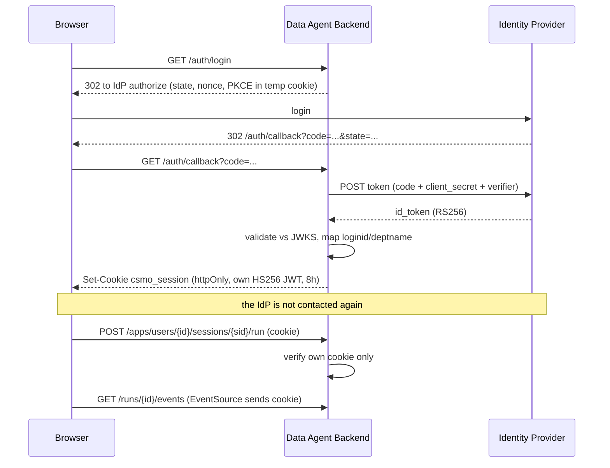
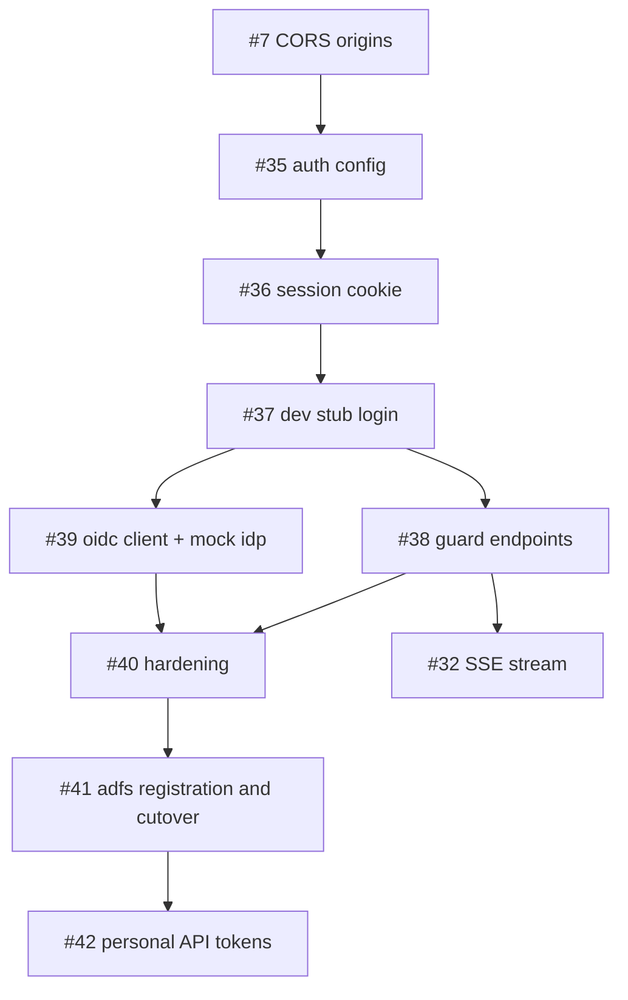

# Authentication and SSO design

**Repository:** `limaxlee/csmo-data-agent-backend`
**Audience:** maintainers, the frontend team, and whoever talks to the SSO team
**Baseline:** `main` at `9a3d572`
**Status:** design agreed, not yet implemented
**Related:** [roadmap.md](roadmap.md) issues #7 (CORS) and #32 (SSE), [migration.md](migration.md)

This service has no authentication. `user_id` arrives as a path parameter in
[runner.py](../data_agent/routers/runner.py), so any caller can read, rename or delete any other
user's chat sessions by editing the URL.

This document describes how company SSO is integrated to fix that, everything that has to be
built, and the order to build it in.

**Sequencing decision:** ADFS registration is deliberately scheduled **last**. The entire service —
including the real OIDC client — is built and verified against a local mock identity provider first.
Registration then changes three configuration values and nothing else.

---

## Contents

1. [Summary](#1-summary)
2. [What we know about the company SSO](#2-what-we-know-about-the-company-sso)
3. [Architecture decision](#3-architecture-decision)
4. [What has to be implemented](#4-what-has-to-be-implemented)
5. [Testing strategy — three tiers](#5-testing-strategy--three-tiers)
6. [Frontend contract](#6-frontend-contract)
7. [Deployment and rollout](#7-deployment-and-rollout)
8. [Issue and PR breakdown](#8-issue-and-pr-breakdown)
9. [What to request from the SSO team](#9-what-to-request-from-the-sso-team)
10. [What to take from the DICE project](#10-what-to-take-from-the-dice-project)
11. [Open questions for our own team](#11-open-questions-for-our-own-team)
12. [Appendix](#12-appendix)

---

## 1. Summary

The company identity provider is **ADFS**, and it speaks **OIDC**. Our backend becomes its own
OIDC **confidential client**: it performs the login redirect, exchanges the authorization code,
reads identity and department from the `id_token`, then issues **its own session cookie**. After
login the backend never contacts ADFS again until the session expires.

| | |
|---|---|
| **Backend work** | ~7 days |
| **Buildable with no external dependency** | **all of it** — see §5 |
| **Blocked on the SSO team** | one relying-party registration, three config values, done last |
| **Code that must be copied from DICE** | **none** — see §10 |
| **Breaking change for the frontend** | yes — see #38 and §6 |

The key enabler: DICE's `platform/backend/app/core/web_auth.py` documents the exact claim set the
company ADFS emits, including `deptname`. That removed the largest unknown — ADFS does not emit
department by default.

### 1.1 Build order at a glance

| Phase | Issues | Depends on anyone else? |
|---|---|---|
| Foundation | #35 config, #36 session cookie | no |
| Working login (stub identity) | #37 auth router | no |
| **The hole closes** | **#38 guard endpoints** | frontend sign-off |
| Real OIDC, verified against a local mock IdP | #39 | no |
| Production hardening | #40 | no |
| **ADFS registration and cutover** | **#41** | **yes — SSO team** |
| Personal API tokens | #42 | deferred |

---

## 2. What we know about the company SSO

### 2.1 Source of these facts

All of it comes from the DICE project, which is an **independent project we cannot integrate with**.
DICE is evidence of what the shared company ADFS is capable of, nothing more. We do not call DICE's
`web-auth` service, we do not share its `SERVICE_JWT_SECRET`, we do not depend on its availability,
and we do not use its credentials (§9.4).

### 2.2 Claims the company ADFS emits

From the docstring of `platform/backend/app/core/web_auth.py`:

| ADFS claim | Example | Meaning |
|---|---|---|
| `loginid` | `donghy.kim` | Samsung ID — the stable user identifier |
| `upn` | `donghy.kim@samsung.com` | User principal name, usable as email |
| `deptname` | — | **Department** |
| `busname` | — | Business unit / company |
| `sid` | — | Security identifier |
| `unique_name` | — | Display name source |
| groups / `role` | — | Optional; **may be absent entirely** |

### 2.3 Confirmed vs. assumed

| Fact | Confidence | Basis |
|---|---|---|
| IdP is ADFS | **Confirmed** | DICE `web_auth.py`, `auth.py`, `security.py` |
| ADFS supports OIDC | **High** | DICE web-auth uses NextAuth, which is OIDC/OAuth2 only |
| `deptname` claim exists | **Confirmed** | Mapped to `department` in `WebAuthPayload` |
| `loginid` is stable | **Assumed** | Used as `sub` and as a DB matching key by DICE |
| Those claims reach *our* app | **Not confirmed** | See §2.4 |
| ADFS version supports PKCE | **Unknown** | ADFS 2019 does; **ADFS 2016 does not**. See §4.9 |

### 2.4 The one real risk: claim rules are per-application

In ADFS, claim issuance rules are configured **per relying-party trust**. DICE's trust has rules
emitting `loginid`, `deptname` and `busname`. A newly registered trust for our application gets
**none of them** by default.

This makes §9's request precise: we ask for our trust to be given *the same claim issuance rules as
the DICE web-auth trust*. That is a copy operation for an ADFS administrator, not a design exercise.

**If `deptname` cannot be issued to our trust**, department must come from a directory/HR API
instead — a separate integration that roughly doubles the estimate. Confirm before committing to a
date.

---

## 3. Architecture decision

### 3.1 Chosen design — backend-for-frontend with a self-issued session

The backend is the OIDC confidential client. The browser never sees an IdP token.



### 3.2 Why this design

Four constraints drove it, three specific to this repository:

1. **[roadmap.md](roadmap.md) issue #32 plans an SSE progress stream.** The browser `EventSource`
   API cannot set an `Authorization` header — it can only send cookies. A Bearer-token design would
   make #32 impossible without a workaround. Roadmap #7 already anticipates "the cookie-
   authenticated SSE endpoint planned in #32".
2. **Agent runs take minutes.** A short-lived IdP access token could expire mid-run. Our own
   8-hour session removes the problem and removes refresh-token handling entirely.
3. **No IdP call on the hot path.** JWKS is fetched at callback time only.
4. **`client_secret` stays server-side.** A browser-based public client would need careful token
   storage; a confidential client avoids the question.

A fifth, decisive for §5: because the IdP is reached through OIDC discovery, **any** OIDC provider
can stand in during development. That is what makes registration schedulable last.

### 3.3 Alternatives considered

| Option | Why not |
|---|---|
| Frontend is a public OIDC client, backend validates IdP tokens | Breaks SSE (#32); token lifetime vs. long runs; refresh tokens in the browser |
| Reuse DICE `web-auth` `/auth/token` | Independent project; cannot deploy against it or share its secret |
| Borrow DICE's `client_id`/`client_secret` for testing | Rejected — §9.4 |
| Deploy Keycloak as production infrastructure (DICE doc 44) | A proposal, not deployed infrastructure. An identity server to operate for no benefit, in front of a working ADFS. (Keycloak **is** used as a local test double — §5.2) |
| Copy DICE's shared-`SERVICE_JWT_SECRET` model | Symmetric secret across services — any holder can forge any user. §10.2 |
| Reverse proxy injecting identity headers | No such gateway exists in front of this service |

### 3.4 Trade-offs we accept

| Trade-off | Impact | Why acceptable |
|---|---|---|
| SSO logout does not propagate | A user logging out elsewhere stays logged in here until the cookie expires | Internal tool, 8h session |
| Department is a login-time snapshot | A transfer is reflected at next login | Department changes are rare |
| Sessions cannot be force-revoked | Stateless cookie, no session table | Short TTL; add a revocation table only if a review demands it |

State these explicitly if a security review asks.

### 3.5 Non-goals

- No user database. The cookie carries identity; ADK's `DatabaseSessionService` already keys chat
  sessions on `user_id`.
- No role-based access control. ADFS `roles` may be absent entirely (§2.2).
- No service-to-service authentication. Nothing calls this backend machine-to-machine yet; see #42.
- No data-level authorization by department. See §11.

---

## 4. What has to be implemented

### 4.1 Complete file inventory

| File | Status | Purpose |
|---|---|---|
| `data_agent/auth/__init__.py` | new | Exports `CurrentUser`, `CurrentUserDep`, `PathUserDep` |
| `data_agent/auth/models.py` | new | `CurrentUser` model |
| `data_agent/auth/session.py` | new | Issue/verify our session JWT; cookie set/clear |
| `data_agent/auth/oidc.py` | new | Discovery, JWKS cache, PKCE, code exchange, `id_token` validation, claim mapping |
| `data_agent/auth/dependencies.py` | new | `get_current_user`, `require_path_user` |
| `data_agent/routers/auth.py` | new | `/auth/login`, `/auth/callback`, `/auth/logout`, `/auth/me` |
| `data_agent/routers/__init__.py` | changed | `include_router(auth_router)` |
| `data_agent/routers/runner.py` | changed | Guard on all eight route handlers |
| `data_agent/routers/logs.py` | changed | Decide: authenticate or remove (§4.8) |
| `data_agent/routers/health.py` | unchanged | **Stays public** — liveness probes |
| `common/config.py` | changed | `AuthConfig`, `SSOConfig`, `allowed_origins`, `_ENV_MAP` |
| `data_agent/__main__.py` | changed | Real CORS origins (roadmap #7), startup validation |
| `config.example.yaml` | changed | New `auth:`, `sso:`, `allowed_origins:` blocks |
| `requirements_py313_prod.txt` | changed | `pyjwt[crypto]` |
| `requirements_py313_dev.txt` | changed | `pyjwt[crypto]` |
| `Dockerfile`, `run_data_agent_backend.sh` | changed | New environment variables |
| `README.md` | changed | Login flow, config, local development |
| `tests/auth/test_session.py` | new | Round trip, expiry, tampering, `alg: none` |
| `tests/auth/test_dependencies.py` | new | 401 and 403 paths |
| `tests/auth/test_oidc.py` | new | Discovery, PKCE, state, nonce, `id_token` validation — IdP mocked |
| `tests/routers/test_auth.py` | new | login / callback / me / logout |
| `tests/routers/test_runner.py` | changed | 401 unauthenticated, 403 cross-user |
| `docker-compose.dev.yml` | new | Local mock IdP (§5.2) |

Test files follow the existing layout — `tests/<package>/test_<module>.py`.

**Nothing below the router layer changes.** `RootAgentRunner`, `OSArtifactService` and the ADK
session service already key on `user_id`.

### 4.2 Dependency

Add **`pyjwt[crypto]`** to both requirements files. `httpx` (0.28.1) is already present and serves
discovery and JWKS; `pytest`, `pytest-asyncio` and `pytest-mock` are already in the dev
requirements.

> `PyJWKClient` is synchronous. Fetch JWKS with `httpx.AsyncClient` and build the key with
> `jwt.PyJWK(...)` rather than calling `PyJWKClient` inside the event loop.

DICE uses `python-jose`; PyJWT is preferred here as it is lighter and more actively maintained.
Either works — this is not a reason to copy from DICE.

### 4.3 Configuration

```yaml
allowed_origins:
  - http://localhost:3000

auth:
  enabled: false                  # false = dev stub identity, no IdP at all
  session_secret: change-me       # HS256 key for OUR cookie. Ours alone.
  session_ttl_hours: 8
  cookie_name: csmo_session
  cookie_secure: false            # true in production (HTTPS only)
  cookie_samesite: lax            # see §4.7
  cookie_domain: null
  frontend_url: http://localhost:3000   # where /auth/callback redirects to
  dev_user:                       # used only when enabled: false
    user_id: dev.user
    department: CSMO Data

sso:
  discovery_url: http://localhost:8080/realms/csmo-dev/.well-known/openid-configuration
  client_id: csmo-data-agent
  client_secret: ""
  redirect_uri: http://localhost:18080/auth/callback
  scopes: [openid, profile, email]
  use_pkce: true                  # false for ADFS 2016 — see §4.9
  post_logout_redirect_uri: http://localhost:3000/
```

Every key gets an `_ENV_MAP` entry so it can be supplied by environment variable in the container,
exactly as the existing keys are:

```
ALLOWED_ORIGINS, AUTH_ENABLED, AUTH_SESSION_SECRET, AUTH_SESSION_TTL_HOURS,
AUTH_COOKIE_NAME, AUTH_COOKIE_SECURE, AUTH_COOKIE_SAMESITE, AUTH_COOKIE_DOMAIN,
AUTH_FRONTEND_URL, SSO_DISCOVERY_URL, SSO_CLIENT_ID, SSO_CLIENT_SECRET,
SSO_REDIRECT_URI, SSO_USE_PKCE
```

`ALLOWED_ORIGINS` and `SSO_SCOPES` are comma-separated in the environment, so `_set_nested_config`
needs a list caster. `AUTH_ENABLED`, `AUTH_COOKIE_SECURE` and `SSO_USE_PKCE` need a bool caster
that treats `"false"` correctly — `bool("false")` is `True`.

**`session_secret` and `client_secret` must never be committed.** See roadmap P0 and #1 —
`config.yaml` is still tracked and has already leaked one set of live credentials.

### 4.4 The identity model

```python
# data_agent/auth/models.py

class CurrentUser(BaseModel):
    """Normalised identity. Nothing outside data_agent/auth/ sees raw IdP claim names."""
    user_id: str                    # loginid, e.g. "donghy.kim"
    email: str | None = None        # upn
    full_name: str | None = None
    department: str | None = None   # deptname
    company: str | None = None      # busname
    roles: list[str] = []
    sid: str | None = None          # audit only
```

Claim mapping, applied once in `oidc.py`:

| IdP claim | `CurrentUser` field | Fallback |
|---|---|---|
| `loginid` | `user_id` | `sub`, then the local part of `upn` |
| `upn` | `email` | `email` claim |
| `unique_name` / `name` | `full_name` | `upn`, then `loginid` |
| `deptname` | `department` | `None` |
| `busname` | `company` | `None` |
| `sid` | `sid` | — |
| groups / `role` | `roles` | `[]` |

`user_id` is `loginid`: human-readable, what ADK session rows will contain, and consistent with
DICE so records can be cross-referenced. `sid` is retained for audit but is not the key.

**Only `user_id` is required.** Every other field must tolerate absence — see §2.4 and the #39
acceptance criteria.

### 4.5 The session cookie

```python
# data_agent/auth/session.py

def issue_session(user: CurrentUser) -> str:
    now = datetime.now(tz=timezone.utc)
    return jwt.encode(
        {
            **user.model_dump(exclude_none=True),
            "iss": "csmo-data-agent",
            "iat": now,
            "exp": now + timedelta(hours=SETTINGS.auth.session_ttl_hours),
        },
        SETTINGS.auth.session_secret,
        algorithm="HS256",
    )


def verify_session(raw: str) -> CurrentUser:
    payload = jwt.decode(
        raw,
        SETTINGS.auth.session_secret,
        algorithms=["HS256"],          # never a list containing "none"
        issuer="csmo-data-agent",
        options={"require": ["exp", "iss"], "verify_exp": True},
    )
    return CurrentUser(**payload)
```

HS256 is correct here because we are both issuer and sole verifier. This is **not** DICE's
shared-secret model (§10.2) — no other service ever receives this key.

### 4.6 The dependencies

```python
# data_agent/auth/dependencies.py

async def get_current_user(request: Request) -> CurrentUser:
    raw = request.cookies.get(SETTINGS.auth.cookie_name)
    if not raw:
        raise HTTPException(status.HTTP_401_UNAUTHORIZED, "Not authenticated")
    try:
        return verify_session(raw)
    except jwt.PyJWTError:
        raise HTTPException(status.HTTP_401_UNAUTHORIZED, "Invalid or expired session")


async def require_path_user(
    user_id: Annotated[str, Path()],
    user: Annotated[CurrentUser, Depends(get_current_user)],
) -> CurrentUser:
    """401 if unauthenticated, 403 if the path user is somebody else."""
    if user_id != user.user_id:
        raise HTTPException(status.HTTP_403_FORBIDDEN, "Access denied")
    return user


CurrentUserDep = Annotated[CurrentUser, Depends(get_current_user)]
PathUserDep = Annotated[CurrentUser, Depends(require_path_user)]
```

One dependency does both checks, so each route in
[runner.py](../data_agent/routers/runner.py) gains exactly one parameter:

```python
@router.get("/users/{user_id}/sessions", response_model=ListSessionsResponse)
async def list_sessions(
        user_id: Annotated[str, Path()],
        user: PathUserDep,              # <- the only new line
        agent_runner: AgentRunner
):
    ...
```

Keeping `{user_id}` in the path and asserting against it means **no URL changes for the frontend**.
Collapsing to `/apps/me/sessions` is cleaner but a larger frontend migration; it can be done later.

### 4.7 Cookie attributes — and the SameSite trap

| Attribute | Value | Reason |
|---|---|---|
| `httponly` | `True` | Not readable by JavaScript |
| `secure` | `auth.cookie_secure` | `True` in production |
| `samesite` | `auth.cookie_samesite`, default `lax` | See below |
| `max_age` | `session_ttl_hours × 3600` | Matches the JWT `exp` |
| `path` | `/` | Needed by `/apps/...`, `/runs/...` and `/auth/me` |

`SameSite=Lax` permits same-site requests and top-level cross-site **GET navigations** — which is
exactly why the IdP redirect back into `/auth/callback` works. It **blocks cross-site XHR/fetch**.
Whether your frontend counts as cross-site depends on the registrable domain, not the port:

| Frontend | Backend | Same site? | Setting |
|---|---|---|---|
| `localhost:3000` | `localhost:18080` | yes — ports are ignored | `lax` |
| `app.example.com` | `api.example.com` | yes — same registrable domain | `lax` |
| `app.corp.com` | `agent.other.com` | **no** | `none` **and** `secure: true` |

`cookie_samesite` is configurable for the third row. `SameSite=None` requires `Secure`, and
therefore HTTPS. Prefer deploying both on one domain so `lax` suffices.

### 4.8 Endpoints

| Endpoint | Auth | Behaviour |
|---|---|---|
| `GET /auth/login` | public | 302 to IdP `authorize`; generates `state`, `nonce`, PKCE verifier into a short-lived signed cookie. In dev-stub mode, issues a session directly |
| `GET /auth/callback` | public | Validates `state`, exchanges the code, validates `id_token`, maps claims, sets the session cookie, 302 to `auth.frontend_url` |
| `GET /auth/me` | required | Returns `CurrentUser`. How the frontend answers "am I logged in?" |
| `POST /auth/logout` | public | Clears the cookie; optionally 302 to `end_session_endpoint` |
| `GET /health` | **public** | Must stay public — liveness probes |
| `/apps/users/{user_id}/**` | required | All eight handlers guarded by `PathUserDep` |
| `/logs/**` | **decide** | See below |

[logs.py](../data_agent/routers/logs.py) currently serves log data with no authentication. That is
its own disclosure problem, independent of SSO. Decide in #38: authenticate it, restrict it to an
operator credential, or remove it. Do not leave it public by omission.

> **`state`, `nonce` and the PKCE verifier must not live in process memory.** Roadmap #34 enables
> `uvicorn --workers`, and a second worker would not find an in-memory entry. Put them in a
> short-lived (10 min) signed cookie, deleted at callback.

### 4.9 PKCE and ADFS version

**ADFS 2019 supports PKCE. ADFS 2016 does not.** Sending `code_challenge` to a server that does not
understand it is usually ignored, but sending `code_verifier` at the token endpoint can fail.

Make it configurable (`sso.use_pkce`), default `true`, and turn it off if the SSO team says ADFS
2016. `state` and `nonce` are used unconditionally and are what actually protect the flow against
CSRF and token replay; PKCE is defence in depth for a confidential client.

### 4.10 Dev stub mode

With `auth.enabled: false`, `GET /auth/login` skips the IdP entirely and issues a session cookie for
`auth.dev_user`. Everything downstream is exercised identically: the cookie, `get_current_user`,
the 403 guards, CORS, SSE, the frontend flow, the tests.

Two reasons it exists:

1. It takes the SSO team off the critical path completely.
2. It keeps the test suite and local development runnable forever, with no IdP in CI.

`enabled: false` **must be loud**: log a prominent warning on every startup, and refuse to start
when combined with `cookie_secure: true` (a combination that only makes sense in production).

---

## 5. Testing strategy — three tiers

This is what makes registering last viable. Each tier tests strictly more than the last.

| Tier | Identity source | Covers | Needs |
|---|---|---|---|
| **1. Dev stub** | `auth.dev_user` | Cookie, dependencies, 401/403 guards, CORS, SSE, frontend flow, whole test suite | nothing |
| **2. Local mock IdP** | Keycloak in Docker | Everything in tier 1 **plus** discovery, JWKS, PKCE, state, nonce, code exchange, RS256 validation, claim mapping | Docker |
| **3. Real ADFS** | Company ADFS | Everything, for real | Registration (#41) |

Tier 2 exercises every line of `oidc.py`. Moving to tier 3 changes `discovery_url`, `client_id` and
`client_secret` — no code.

### 5.1 Tier 1 — dev stub

`auth.enabled: false`, then `GET /auth/login`. Used by CI and by everyday local work. Unit tests
construct session cookies directly via `issue_session()`.

### 5.2 Tier 2 — local mock IdP (Keycloak)

Keycloak is used here purely as a **disposable test double**. It is not proposed as production
infrastructure (§3.3). It issues RS256 tokens over standard OIDC discovery, which is the same shape
ADFS presents.

`docker-compose.dev.yml`:

```yaml
services:
  mock-idp:
    image: quay.io/keycloak/keycloak:26.0
    command: start-dev
    environment:
      KC_BOOTSTRAP_ADMIN_USERNAME: admin
      KC_BOOTSTRAP_ADMIN_PASSWORD: admin
    ports:
      - "8080:8080"
```

```bash
docker compose -f docker-compose.dev.yml up -d
# admin console: http://localhost:8080  (admin / admin)
```

Set-up in the admin console:

1. **Create realm** `csmo-dev`.
2. **Create client** `csmo-data-agent`:
   - Client authentication **ON** (confidential — this is what gives you a `client_secret`)
   - Standard flow **ON**, Direct access grants **OFF**
   - Valid redirect URI: `http://localhost:18080/auth/callback`
   - Web origins: `http://localhost:3000`
   - Copy the secret from the **Credentials** tab into `sso.client_secret`.
3. **Create a user**, set a non-temporary password, and add these **attributes** — these are the
   values that will become claims:

   | Attribute | Value |
   |---|---|
   | `loginid` | `donghy.kim` |
   | `deptname` | `CSMO Data` |
   | `busname` | `DX` |

4. **Add protocol mappers** so those attributes appear in the `id_token`. On the client →
   *Client scopes* → `csmo-data-agent-dedicated* → *Add mapper* → *By configuration* →
   **User Attribute**, once per row:

   | Name | User Attribute | Token Claim Name | Add to ID token |
   |---|---|---|---|
   | `loginid` | `loginid` | `loginid` | ON |
   | `deptname` | `deptname` | `deptname` | ON |
   | `busname` | `busname` | `busname` | ON |

   Keycloak already emits `upn`-equivalent data via the `email`/`profile` scopes; add a further
   User Attribute mapper named `upn` if you want that exact claim name.

5. Point configuration at it:

```yaml
auth:
  enabled: true
sso:
  discovery_url: http://localhost:8080/realms/csmo-dev/.well-known/openid-configuration
  client_id: csmo-data-agent
  client_secret: <from the Credentials tab>
  redirect_uri: http://localhost:18080/auth/callback
```

Export the realm once it works, and commit the export so the setup is reproducible:

```bash
docker compose -f docker-compose.dev.yml exec mock-idp \
  /opt/keycloak/bin/kc.sh export --dir /tmp/export --realm csmo-dev
```

### 5.3 Fidelity — where the mock differs from ADFS

Known differences to expect at tier 3. None require code changes; all are configuration or
tolerance already specified in #39.

| Aspect | Keycloak | ADFS |
|---|---|---|
| Discovery path | `/realms/<realm>/.well-known/openid-configuration` | `/adfs/.well-known/openid-configuration` |
| PKCE | supported | 2019 yes, **2016 no** (§4.9) |
| `aud` | the `client_id` | `client_id`, or a separate resource identifier |
| Claim names | whatever the mappers say | fixed by the trust's claim rules |
| Logout | `end_session_endpoint` | present, different parameters |
| Signing | RS256 | RS256 |

Because of the `aud` row, validate `aud` against a configured value rather than assuming it equals
`client_id`.

### 5.4 What CI runs

CI runs **tier 1 only**. `tests/auth/test_oidc.py` mocks the discovery document, JWKS and token
endpoint with `pytest-mock`/`httpx` transports. No test ever contacts Keycloak or ADFS — tier 2 is a
developer activity, not a pipeline stage.

---

## 6. Frontend contract

The frontend change is small but mandatory; #38 breaks it otherwise. Hand this section to the
frontend team before #38 opens.

**1. Send credentials on every request.** Cookies are not sent cross-origin by default.

```js
fetch(url, { credentials: "include", ... })
```

**2. Check session on boot.**

```js
const r = await fetch(`${API}/auth/me`, { credentials: "include" });
if (r.status === 401) window.location.href = `${API}/auth/login`;
else setUser(await r.json());
```

**3. Handle 401 globally.** Any `/apps` call returning 401 means the session expired mid-use →
redirect to `${API}/auth/login`. Do not retry.

**4. Handle 403 differently.** 403 means authenticated but requesting someone else's `user_id` — a
bug in the client, not an expired session. Show an error; do not redirect, or you create a loop.

**5. Log out via the backend.** `POST ${API}/auth/logout` with `credentials: "include"`, then
redirect. Do not just delete client state — the cookie is `httpOnly` and unreachable from JS.

**6. Store nothing.** No token in `localStorage`, no user id in the URL taken from client state.
`user_id` comes from `/auth/me`.

**7. SSE needs `withCredentials`** (roadmap #32):

```js
new EventSource(`${API}/runs/${runId}/events`, { withCredentials: true })
```

**8. The backend must list the frontend origin** in `allowed_origins`, with `allow_credentials=True`
and never `*` — roadmap #7.

---

## 7. Deployment and rollout

### 7.1 Environment

| Setting | Development | Production |
|---|---|---|
| `auth.enabled` | `false` (tier 1) or `true` (tier 2) | `true` |
| `auth.cookie_secure` | `false` | **`true`** (requires HTTPS) |
| `auth.session_secret` | anything | `openssl rand -hex 32`, from a secret store |
| `allowed_origins` | `http://localhost:3000` | the real frontend origin, never `*` |
| `sso.*` | mock IdP | company ADFS |

Secure cookies require HTTPS, so production needs TLS termination in front of the service. If a
reverse proxy terminates TLS, it must forward `X-Forwarded-Proto` and the app should honour it, or
redirect URIs will be generated as `http://`.

### 7.2 Existing chat sessions will be orphaned

**Plan for this before #38 ships.** ADK's `DatabaseSessionService` stores rows in the `cosmoData`
Postgres keyed on whatever `user_id` the frontend passed — today an unauthenticated, arbitrary
string. After SSO, `user_id` is the ADFS `loginid`. Old rows will not match any authenticated user
and become invisible.

Three options:

| Option | When |
|---|---|
| Accept the loss | Demo data only. Simplest. State it, do not discover it |
| Map old → new with SQL before cutover | A known, small set of real users |
| Wipe the sessions table | Pre-production, nothing worth keeping |

Whichever you choose, decide it explicitly and record it in the #38 PR.

### 7.3 Cutover order

1. Deploy backend with `auth.enabled: false` and the guards active (#38). Backend and frontend are
   now both auth-aware, with a stub identity.
2. Frontend deploys the §6 changes.
3. Flip `auth.enabled: true` with mock or real IdP configuration (#41). No redeploy needed — it is
   configuration.

The guards ship before the real IdP does. That sequencing is deliberate: the security hole closes at
step 1, and step 3 only changes where identity comes from.

---

## 8. Issue and PR breakdown

Following [roadmap.md](roadmap.md) conventions: one issue → one branch → one PR → a `feat:` commit
and a `test:` commit. Numbering continues from the existing #34.



**Only #41 depends on anyone outside this repository.**

---

### Issue #35 — Auth configuration block and dependency

**Labels:** `feat`, `auth` · **Depends on:** #1 (untrack config.yaml), #7 (CORS)

**Why.** Every later issue reads this configuration. Landing it alone keeps those diffs small and
makes secret handling a single review conversation.

**Scope.**
- `AuthConfig`, `AuthDevUser` and `SSOConfig` in [common/config.py](../common/config.py); add them
  plus `allowed_origins` to `Settings`.
- `_ENV_MAP` entries for every key in §4.3, with list and bool casters.
- `auth:`, `sso:`, `allowed_origins:` in `config.example.yaml` with placeholders.
- `pyjwt[crypto]` in both requirements files.

**Acceptance criteria.**
- [ ] `SETTINGS.auth.enabled` and `SETTINGS.sso.client_id` load from file and from environment.
- [ ] `ALLOWED_ORIGINS="a,b"` parses to `["a", "b"]`.
- [ ] `AUTH_ENABLED=false` yields `False`, not `True`.
- [ ] `config.example.yaml` contains no real values.
- [ ] The service starts when the block is absent from an old config file, defaulting to
      `enabled: false`.

**PR:** `feat/35-auth-config`

| # | Commit | Contents |
|---|---|---|
| 1 | `feat: add auth and sso configuration` | `common/config.py`, `config.example.yaml`, `requirements_py313_*.txt` |
| 2 | `test: cover auth config loading and env overrides` | `tests/test_config.py` |

---

### Issue #36 — Session cookie issue and verification

**Labels:** `feat`, `auth` · **Depends on:** #35

**Why.** The session token is the core primitive — pure, no HTTP, no IdP, fully testable alone.

**Scope.** `data_agent/auth/models.py` (§4.4), `session.py` (§4.5 plus cookie helpers applying
§4.7), `dependencies.py` (§4.6), `__init__.py` exports.

**Acceptance criteria.**
- [ ] A round trip preserves every `CurrentUser` field, including `department`.
- [ ] Expired, wrong-secret and tampered-payload tokens each raise.
- [ ] `alg: none` is rejected.
- [ ] A token with no `exp` is rejected.
- [ ] `get_current_user` raises 401 with no cookie and 401 with a bad cookie.
- [ ] `require_path_user` raises 403 when the path `user_id` differs from the session's.
- [ ] The cookie is `httponly`; `secure` and `samesite` follow configuration.

**PR:** `feat/36-session-cookie`

| # | Commit | Contents |
|---|---|---|
| 1 | `feat: issue and verify session cookies` | `data_agent/auth/__init__.py`, `models.py`, `session.py`, `dependencies.py` |
| 2 | `test: cover session round trip, expiry and tampering` | `tests/auth/test_session.py`, `tests/auth/test_dependencies.py` |

---

### Issue #37 — Auth router with development stub login

**Labels:** `feat`, `auth` · **Depends on:** #36

**Why.** Gives the frontend a complete working login flow immediately, and gives every later test a
way to authenticate.

**Scope.**
- `data_agent/routers/auth.py` with `/auth/login`, `/auth/logout`, `/auth/me`.
- `enabled: false` → `/auth/login` issues a session for `auth.dev_user`, 302 to
  `auth.frontend_url`. `enabled: true` → `NotImplementedError` until #39.
- Register in `data_agent/routers/__init__.py`.
- Startup warning per §4.10; refuse `enabled: false` with `cookie_secure: true`.

**Acceptance criteria.**
- [ ] Dev-mode `/auth/login` sets a valid cookie and 302s to the configured frontend.
- [ ] `/auth/me` returns the dev user with that cookie, 401 without.
- [ ] `/auth/logout` clears the cookie; a subsequent `/auth/me` is 401.
- [ ] `/health` needs no cookie.
- [ ] Startup logs a warning when `enabled: false`.

**PR:** `feat/37-auth-router-stub`

| # | Commit | Contents |
|---|---|---|
| 1 | `feat: add auth router with development login stub` | `data_agent/routers/auth.py`, `routers/__init__.py`, `data_agent/__main__.py` |
| 2 | `test: cover stub login, me and logout` | `tests/routers/test_auth.py` |

---

### Issue #38 — Require authentication on the runner endpoints

**Labels:** `feat`, `auth`, `breaking` · **Depends on:** #37 · **Blocks:** #32

**Why.** This is the issue that closes the hole. Until it merges, `user_id` in the URL is an
unauthenticated claim.

**Scope.**
- `user: PathUserDep` on every handler in [runner.py](../data_agent/routers/runner.py):
  `list_sessions`, `create_session`, `create_session_title`, `rename_session_title`, `get_session`,
  `delete_session`, `load_session_artifact`, `run`.
- Resolve [logs.py](../data_agent/routers/logs.py) per §4.8.
- Leave [health.py](../data_agent/routers/health.py) public.
- Record the §7.2 decision about existing sessions in the PR description.
- README: login flow and the §6 contract.

**Acceptance criteria.**
- [ ] Every `/apps` endpoint returns 401 without a cookie.
- [ ] Every `/apps` endpoint returns 403 when the path `user_id` is not the session's.
- [ ] With a matching cookie, behaviour is unchanged.
- [ ] `/health` is still 200 without a cookie.
- [ ] `/logs` behaves as decided, and the decision is documented.
- [ ] The frontend team has signed off before this opens — same rule as roadmap #30.

**Out of scope.** Collapsing paths to `/apps/me/...`.

**PR:** `feat/38-guard-runner-endpoints`

| # | Commit | Contents |
|---|---|---|
| 1 | `feat: require an authenticated session on runner endpoints` | `data_agent/routers/runner.py`, `logs.py`, `README.md` |
| 2 | `test: cover unauthenticated and cross-user access` | `tests/routers/test_runner.py` |

---

### Issue #39 — OIDC client, verified against a local mock IdP

**Labels:** `feat`, `auth` · **Depends on:** #37 · **Blocked by:** nothing

**Why.** The real protocol implementation. It needs no company infrastructure — §5.2's Keycloak
container is a complete stand-in.

**Scope.**
- `data_agent/auth/oidc.py`:
  - discovery fetch and cache;
  - JWKS fetch and cache, one refresh on unknown `kid`;
  - authorization URL with `state`, `nonce`, and PKCE `S256` when `sso.use_pkce`;
  - code exchange at `token_endpoint` with `client_id` + `client_secret`;
  - `id_token` validation — signature, `iss`, `aud`, `exp`, `nonce`;
  - claim mapping per §4.4.
- `/auth/login` and `/auth/callback` for `enabled: true`.
- `state`, `nonce` and verifier in a signed 10-minute cookie, **not** process memory (§4.8).
- `/auth/logout` optionally redirects to `end_session_endpoint`.
- `docker-compose.dev.yml` and the realm export from §5.2.
- README section on running against the mock IdP.

**Acceptance criteria.**
- [ ] `/auth/login` 302s to the authorization endpoint with `state`, `nonce`, and `code_challenge`
      when PKCE is on.
- [ ] `use_pkce: false` omits `code_challenge` and still completes.
- [ ] A callback with a mismatched or missing `state` is rejected.
- [ ] A callback with a mismatched or missing `nonce` is rejected.
- [ ] An `id_token` with a bad signature, wrong `iss`, wrong `aud` or past `exp` is rejected.
- [ ] An unknown `kid` triggers exactly one JWKS refresh, then fails if still unknown.
- [ ] `deptname` lands in `CurrentUser.department`; **missing `deptname` yields `None`, not an
      error**; likewise `busname`, `sid` and roles.
- [ ] A full login against the §5.2 Keycloak container produces a working session end to end.
- [ ] Every test mocks the IdP — CI contacts nothing.

**Out of scope.** Refresh tokens; we deliberately discard IdP tokens after callback (§3.2).

**PR:** `feat/39-oidc-client`

| # | Commit | Contents |
|---|---|---|
| 1 | `feat: authenticate against an oidc provider` | `data_agent/auth/oidc.py`, `data_agent/routers/auth.py`, `docker-compose.dev.yml`, `README.md` |
| 2 | `test: cover discovery, pkce, state, nonce and id_token validation` | `tests/auth/test_oidc.py` |

---

### Issue #40 — Production hardening

**Labels:** `chore`, `security` · **Depends on:** #38, #39

**Why.** Development defaults are wrong in production, and a security review will ask for the audit
trail.

**Scope.**
- Refuse to start with a default or empty `session_secret` when `cookie_secure` is on.
- Refuse to start with `enabled: false` when `cookie_secure` is on.
- Honour `X-Forwarded-Proto` when building redirect URIs (§7.1).
- Log every 401 and 403 with cause, path and `user_id` where known — **never** token material.
  Reuse [utils/logger.py](../data_agent/utils/logger.py).
- Document every new environment variable in the README, `Dockerfile` and
  `run_data_agent_backend.sh`.

**Acceptance criteria.**
- [ ] Startup fails on a default `session_secret` with secure cookies on.
- [ ] Auth failures appear in the log with cause and path; no token or secret is ever logged.
- [ ] Behind a TLS-terminating proxy, generated redirect URIs are `https://`.
- [ ] Deployment documentation lists every new environment variable.

**PR:** `chore/40-auth-hardening`

| # | Commit | Contents |
|---|---|---|
| 1 | `chore: harden auth configuration for production` | `common/config.py`, `data_agent/__main__.py`, `README.md`, `Dockerfile`, `run_data_agent_backend.sh` |
| 2 | `test: cover startup validation and failure logging` | `tests/auth/test_hardening.py` |

---

### Issue #41 — ADFS registration and cutover

**Labels:** `chore`, `auth` · **Depends on:** #40 · **Blocked by:** the SSO team (§9)

**Why.** The only externally blocked work, and by this point the only thing left. Everything has
already been proven against the mock IdP.

**Scope.**
- Send §9.1 to the SSO team; obtain `discovery_url`, `client_id`, `client_secret`, and approval of
  the redirect URIs.
- Populate production configuration from a secret store.
- Verify the real `id_token` claim names against §4.4 and adjust the mapping **only if** ADFS
  differs from what §2.2 documents.
- Set `use_pkce` per the ADFS version (§4.9).
- Confirm `aud` and set it explicitly (§5.3).
- Execute the §7.2 session decision and the §7.3 cutover.

**Acceptance criteria.**
- [ ] A real company account logs in end to end.
- [ ] `department` is populated from the real `deptname`.
- [ ] `user_id` matches the ADFS `loginid`.
- [ ] Logout clears the session.
- [ ] Nothing in `data_agent/auth/` changed other than configuration — or, if it did, the diff is
      explained in the PR.

**PR:** `chore/41-adfs-cutover`

| # | Commit | Contents |
|---|---|---|
| 1 | `chore: configure production adfs identity provider` | `config.example.yaml`, `README.md`, deployment manifests |
| 2 | `test: cover adfs claim mapping fixtures` | `tests/auth/test_oidc.py` — a recorded real `id_token` payload, secrets stripped |

---

### Issue #42 — Personal API tokens for non-browser clients *(deferred)*

**Labels:** `enhancement`, `auth` · **Depends on:** #41

**Why.** Cookies are browser-only. Scripts, CI and monitoring cannot complete a redirect. Open this
when something actually needs it.

**Scope.** The one place adapting DICE code is worthwhile (§10.1): `csmo_pat_<urlsafe-random>`,
store only the SHA-256, return plaintext exactly once, keep a display prefix for the list UI.
Introduces the first user-owned table in this service.

**Acceptance criteria.**
- [ ] A token authenticates as its owner on every `/apps` endpoint.
- [ ] Only the hash is persisted; plaintext appears in exactly one response.
- [ ] Revocation is immediate.
- [ ] Prefix routing distinguishes a PAT from a session cookie.

**PR:** `feat/42-personal-api-tokens`

---

## 9. What to request from the SSO team

Scheduled at #41. Send it as early as lead time demands — registration can take weeks and costs
nothing to start — but no code waits on it.

### 9.1 The request

> We are building an internal FastAPI service (COSMO Data Agent) that needs company SSO login. We
> would like to register it as a new OIDC relying party against ADFS.
>
> **To begin with we only need a development client** — localhost redirect URI, restricted to a test
> account. We will request production registration separately once the integration is proven.
>
> 1. Please register a **relying-party trust / OIDC client** for our application, **with the same
>    claim issuance rules as the DICE `web-auth` trust** — specifically `loginid`, `upn`,
>    `deptname`, `busname` and `sid`. We depend on `deptname` in particular.
> 2. We need a **confidential client**: `client_id` plus `client_secret`. Our backend performs the
>    authorization-code exchange server-side; no secret reaches the browser.
> 3. Please confirm the **discovery URL**, e.g.
>    `https://<adfs-host>/adfs/.well-known/openid-configuration`.
> 4. Redirect URIs to register:
>    - development: `http://localhost:18080/auth/callback`
>    - production (later): `https://<our-host>/auth/callback`
> 5. **Which ADFS version?** We need to know whether PKCE is supported (2019 yes, 2016 no).
> 6. What value will the `aud` claim carry — the `client_id`, or a separate resource identifier?
> 7. Is there a test/staging ADFS instance and a test account?
> 8. Can ADFS reach our redirect URI from where the service is deployed, or is a network/firewall
>    approval also required?
> 9. Is there a mandatory security review before production?

### 9.2 What each answer unblocks

| Answer | Unblocks |
|---|---|
| Discovery URL, `client_id`, `client_secret` | `sso.*` — issue #41 |
| Redirect URI approved | Local development against real ADFS |
| Claim rules confirmed | Whether `department` works at all — §2.4 |
| ADFS version | `sso.use_pkce` — §4.9 |
| `aud` value | Audience validation — §5.3 |
| Test instance | #41 acceptance criteria without touching production |

### 9.3 Also worth asking the DICE team

Two requests, neither of them a credential, both free for them:

> 1. Could you send a **sample decoded raw ADFS `id_token`** — not the `web-auth` service token, the
>    one ADFS itself returns? We want to confirm exact claim names and value formats.
> 2. What is the **name of your relying-party trust and its claim rule set**, so our registration
>    request can say "the same as theirs"?

The sample token is what makes the §5.2 mock a faithful rehearsal. Get it early — it costs them two
minutes and de-risks #41.

### 9.4 Why we do not borrow DICE's credentials

Considered and rejected. Using DICE's `client_id` for our own testing fails on protocol grounds:
OAuth2 requires exact `redirect_uri` matching against the values registered for that client
(RFC 6749 §3.1.2.3), and ADFS enforces it. Our callback URL is not on their list, so the flow stops
before a login page ever appears.

Making it work would need the DICE team to add our URL to their **production** trust and share their
**production `client_secret`**. Both are bad:

- Adding a redirect URI to a live client widens exactly the attack surface that check exists to
  prevent.
- Their `client_secret` would let us impersonate their application, and a leak from this repository
  would be their incident. This repository has already leaked live credentials once through tracked
  `config.yaml` (roadmap P0, still open).
- `id_token`s would carry `aud = <dice client_id>`, so their tokens and ours would be
  interchangeable.

§5.2 gives the same testing value with none of this.

---

## 10. What to take from the DICE project

**Direct answer: no DICE code needs to be copied. Not one line.**

DICE is an independent project. We take no dependency on it — not its `web-auth` service, not its
`SERVICE_JWT_SECRET`, not its credentials, not its packages. Its value here was **informational**:
the claim names in §2.2, which we would otherwise have had to discover by asking.

| DICE artefact | Action |
|---|---|
| `web_auth.py` | **Read for the claim names only.** Do not copy — its verification model is wrong for us (§10.2) |
| `AUTHENTICATION_GUIDE.md` (service JWT) | Not applicable — service-to-service, we have no such caller |
| `KEYCLOAK_SSO_SETUP_GUIDE.md` | Its Keycloak *setup steps* are useful as a local **test double** recipe (§5.2). Its proposal to run Keycloak in production is rejected (§3.3) |
| `api_token.py` | **The one file worth adapting**, and only at #42 — deferred |
| `security.py`, `config.py` | Not applicable |

### 10.1 Patterns worth reproducing (write our own)

**Claim normalisation.** `WebAuthPayload` maps raw IdP claims to a stable internal model. Our
`CurrentUser` does the same, so nothing outside `data_agent/auth/` ever sees the string `deptname`.
If ADFS renames a claim, one file changes. Same idea, our own code — ~15 lines.

**Credential-type routing.** `is_web_auth_token()` and `is_api_token()` inspect a prefix or the
unverified `iss` to choose a verifier before validating. Relevant at #42.

**Role mapping that does not demote.** `map_web_auth_roles_to_system_role` returns `None` when the
IdP sends no role claim, and the caller keeps the user's existing role. Inverting this would
silently demote every user on any login where ADFS omits groups. Worth remembering if we add roles.

**Personal API token design** (`api_token.py`) — prefix, hash-only storage, one-time plaintext.
The only place literal adaptation is worthwhile, at #42.

### 10.2 What not to reproduce

**The shared `SERVICE_JWT_SECRET`.** DICE signs user tokens with one symmetric HS256 secret shared
across `web-auth`, Platform and Labeler. Any service that can *verify* a user token can also *forge*
one — Labeler can mint a token claiming to be any user and present it to Platform. It is also
committed with a guessable default:

```python
SERVICE_JWT_SECRET: str = "service-jwt-secret-change-in-production-use-openssl-rand-hex-32"
```

Our session secret is held by one service, which both issues and verifies it. The distinction is not
HS256 versus RS256 — it is how many parties hold the key.

**`verify_aud: False`.** DICE disables audience validation. We validate `aud` (#39, §5.3).

**Backend-does-not-know-the-IdP.** DICE's backends never speak OIDC; a separate Next.js service does
it and re-signs. That is a sound design *when you own a shared login service*. We do not, and
building one would mean deploying a second service for one application.

---

## 11. Open questions for our own team

**What is `department` for?** This decides whether anything beyond §4 is needed.

| If department is for… | Then |
|---|---|
| Display and audit logging | Done at #38. Read it off `CurrentUser`; nothing else changes |
| Restricting **which data the agent may query** | A separate authorization design reaching into [root_agent.py](../data_agent/agents/root_agent.py) and the Mongo/Milvus MCP tool layer — filtering collections, or injecting a department predicate into generated queries |

The second is substantially larger than this document, cannot be enforced at the router layer, and
must be scoped separately. Answer it before committing to a date, and do not let the two get
conflated.

**Others:**

- Should chat sessions ever be shared within a department? The current model is strictly per-user
  and #38 hard-codes that.
- What happens when a `loginid` changes? Sessions are keyed on it and would be orphaned. Rare
  enough to accept, but make it a conscious decision.
- Is `/logs` public, operator-only, or removed (§4.8)?
- What happens to existing chat sessions at cutover (§7.2)?

---

## 12. Appendix

### A. Environment variables

| Variable | Example | Notes |
|---|---|---|
| `ALLOWED_ORIGINS` | `https://agent.example.com` | Comma-separated. Never `*` with credentials |
| `AUTH_ENABLED` | `true` | `false` = dev stub |
| `AUTH_SESSION_SECRET` | `openssl rand -hex 32` | Ours alone. Never shared, never committed |
| `AUTH_SESSION_TTL_HOURS` | `8` | |
| `AUTH_COOKIE_NAME` | `csmo_session` | |
| `AUTH_COOKIE_SECURE` | `true` | `true` in production; requires HTTPS |
| `AUTH_COOKIE_SAMESITE` | `lax` | `none` only if truly cross-site (§4.7) |
| `AUTH_FRONTEND_URL` | `https://agent.example.com` | Where `/auth/callback` redirects |
| `SSO_DISCOVERY_URL` | `https://<adfs>/adfs/.well-known/openid-configuration` | Mock IdP until #41 |
| `SSO_CLIENT_ID` | `csmo-data-agent` | |
| `SSO_CLIENT_SECRET` | — | Secret |
| `SSO_REDIRECT_URI` | `https://<our-host>/auth/callback` | Must match registration exactly |
| `SSO_USE_PKCE` | `true` | `false` for ADFS 2016 (§4.9) |

### B. Debugging

```bash
# Discovery document
curl -s "$SSO_DISCOVERY_URL" | jq

# JWKS
curl -s "$(curl -s "$SSO_DISCOVERY_URL" | jq -r .jwks_uri)" | jq

# Inspect a session cookie without verifying (development only)
python -c "import jwt,sys; print(jwt.decode(sys.argv[1], options={'verify_signature': False}))" "$TOKEN"

# Watch the login redirect without following it
curl -si "http://localhost:18080/auth/login" | head -20
```

Never paste a company token into jwt.io or any other external site.

### C. Common failures

| Symptom | Cause | Fix |
|---|---|---|
| `Invalid redirect URI` | `sso.redirect_uri` differs from the registration | Must match exactly — scheme, port, trailing slash |
| CORS error on login | `allowed_origins` missing the frontend origin | Roadmap #7. `*` with `allow_credentials=True` is rejected by browsers |
| `Invalid issuer` / `Invalid audience` | `iss` or `aud` mismatch | Compare with the discovery document; `aud` may not equal `client_id` (§5.3) |
| `Unable to find matching key for kid` | The IdP rotated signing keys | JWKS refresh on unknown `kid` (#39) |
| `department` is `None` | Claim rule not applied to our trust | §2.4 — claim rules are per relying party |
| Cookie not sent by fetch | `SameSite` too strict for a cross-site frontend, or `credentials` omitted | §4.7 and §6 item 1 |
| Cookie not set at all | `secure: true` over plain HTTP | `cookie_secure: false` in development |
| Login loops forever | Frontend redirects to `/auth/login` on 403 as well as 401 | §6 item 4 |
| SSE stream unauthenticated | `EventSource` cannot set headers | Cookie-based by design (§3.2); `withCredentials: true` (§6 item 7) |
| Redirect URI generated as `http://` behind TLS | `X-Forwarded-Proto` ignored | §7.1, #40 |
| Old chat sessions vanish after cutover | `user_id` changed to `loginid` | §7.2 — decide before shipping #38 |

### D. Summary

| Issue | Theme | External dependency | Estimate |
|---|---|---|---|
| #35 | Configuration and dependency | no | 0.5d |
| #36 | Session cookie and dependencies | no | 1d |
| #37 | Auth router with dev stub | no | 1d |
| #38 | Guard the runner endpoints | frontend sign-off | 1d |
| #39 | OIDC client + mock IdP | no | 2.5d |
| #40 | Production hardening | no | 1d |
| #41 | ADFS registration and cutover | **SSO team** | 0.5d + wait |
| #42 | Personal API tokens | no | deferred |
| | | | **~7.5d** |

**Critical path:** #7 → #35 → #36 → #37 → #38, then #39 → #40 → #41.

**Ship first:** #38 closes the actual hole. Everything before it exists to make #38 possible;
#39 and #41 only change where identity comes from.
