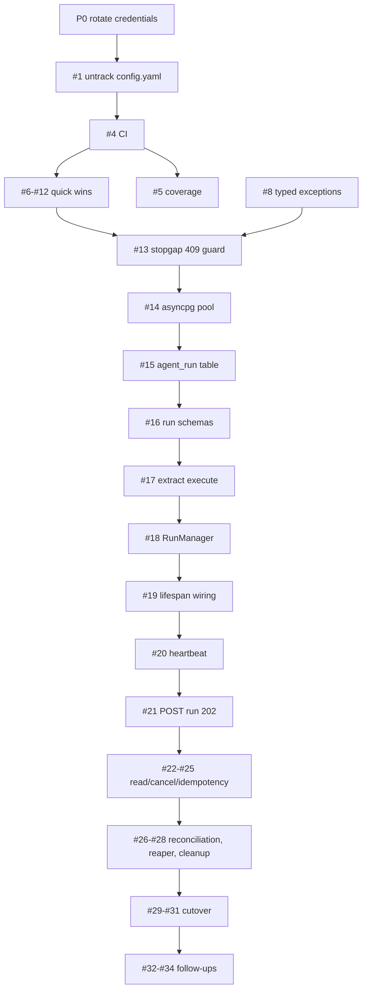

# Issue and pull request roadmap

**Repository:** `limaxlee/csmo-data-agent-backend`
**Audience:** maintainers
**Baseline:** `main` at `3244fca`, already pushed to GitHub

This is the order in which issues should be opened and their pull requests merged. Every issue maps
to exactly one branch and one PR. The end state is the asynchronous run model described in
[migration.md](migration.md).

---

## Conventions

**One issue → one branch → one PR → at least two commits.**

| Commit | Prefix | Contents |
|---|---|---|
| 1 | `feat:` / `fix:` / `refactor:` / `chore:` | the change itself, no tests |
| 2 | `test:` | the tests covering that change |

Splitting this way keeps the diff reviewable: a reviewer can read the behaviour change on its own,
then read the tests as an independent statement of what is guaranteed. Larger issues below list
three or four commits where the feature genuinely splits.

- **Branches:** `<type>/<issue-number>-<slug>`, e.g. `feat/15-agent-run-table`.
- **PR title:** same as the issue title. Body opens with `Closes #<n>`.
- **Merge strategy:** merge commit, not squash — squashing would collapse the feat/test split that
  this plan is built around.
- **Definition of done:** CI green, every acceptance criterion checked, no new `except Exception`
  that swallows a typed error.

> **Two PRs in this plan have no unit-testable surface** (#2 README, #3 repo templates). Those pair
> the feature commit with a `docs:` or `chore:` commit instead. They are flagged inline. Every other
> PR carries real tests.

Issues #16 and #1 add tests under `tests/` for `data_agent/schemas/` and `common/` respectively.
That is a deliberate widening of the current test scope, which so far excludes both.

---

## P0 — Do this before opening any issue

**This is an operations task, not a pull request.**

`config.yaml` is tracked in commit `0c638bf` and is already on GitHub. It contains a live Samsung
GenAI OpenAPI client key, a live bearer pass key, and live object-storage access/secret keys.

Rewriting history does **not** fix this. The commit has been pushed; it may already be cloned,
forked, cached by GitHub, or indexed by a secret scanner.

1. **Rotate all four credentials at their source.** Until this is done, nothing else on this list
   matters.
2. Confirm whether the repository is public or private, and who has had access.
3. Only then proceed to Issue #1, which removes the file from tracking going forward.

A history rewrite (`git filter-repo`) is optional cleanup afterwards. It is not the remedy.

---

## Dependency graph

---

## Milestone 1 — Repository hygiene

### Issue #1 — Remove `config.yaml` from version control

**Labels:** `security`, `chore` · **Depends on:** P0 rotation · **Blocks:** everything

**Why.** Configuration containing live credentials is tracked in git. Even after rotation, the file
must stop being a tracked artifact or the next set of keys leaks the same way.

**Scope.**
- `git rm --cached config.yaml`; add `config.yaml` to `.gitignore` (it currently lists `.env` but
  not this file).
- Add `config.example.yaml` with the same structure and obviously-fake placeholder values.
- Document in the README and `Dockerfile` that the real config is mounted or supplied via the
  `_ENV_MAP` environment variables in [common/config.py](../common/config.py).

**Acceptance criteria.**
- [ ] `git ls-files config.yaml` returns nothing.
- [ ] A fresh clone plus `cp config.example.yaml config.yaml` starts the service.
- [ ] Every key in `_ENV_MAP` appears in `config.example.yaml`.

**Out of scope.** History rewriting; credential rotation (P0).

**PR:** `chore/1-untrack-config`

| # | Commit | Contents |
|---|---|---|
| 1 | `chore: untrack config.yaml and add config.example.yaml` | `.gitignore`, `config.example.yaml`, `Dockerfile`, `README.md` |
| 2 | `test: cover config loading and env overrides` | `tests/test_config.py` — `load_config` reads the example file, `_ENV_MAP` entries override it, bad casts raise |

---

### Issue #2 — README covering setup, run and test

**Labels:** `docs` · **Depends on:** #1

**Why.** The README is one line. Nobody can run this project, or its tests, without reading source.

**Scope.** Prerequisites, config setup, local run (`python -m data_agent -c config.yaml`), Docker
build/run, `pytest` invocation, project layout, links to `docs/`.

**Acceptance criteria.**
- [ ] A new developer can go from clone to running service using only the README.
- [ ] The test section names the `requirements_py313_dev.txt` extras (`pytest`, `pytest-mock`).

**PR:** `docs/2-readme` — *no unit-testable surface.*

| # | Commit | Contents |
|---|---|---|
| 1 | `docs: expand README with setup, run and test instructions` | `README.md` |
| 2 | `docs: link architecture and migration docs from README` | `README.md`, `docs/` index links |

---

### Issue #3 — Issue templates, PR template, CODEOWNERS

**Labels:** `chore` · **Depends on:** none (parallel with #1, #2)

**Why.** This roadmap assumes a consistent issue shape. Encode it so it survives contact with other
contributors.

**Scope.** `.github/ISSUE_TEMPLATE/bug_report.yml`, `feature_request.yml`,
`.github/pull_request_template.md` (with a "commits are split feat/test" checkbox), `CODEOWNERS`,
and a documented branch-protection setting requiring CI plus one review.

**Acceptance criteria.**
- [ ] Opening an issue on GitHub offers the templates.
- [ ] The PR template checklist includes the two-commit rule.

**PR:** `chore/3-github-templates` — *no unit-testable surface.*

| # | Commit | Contents |
|---|---|---|
| 1 | `chore: add issue and pull request templates` | `.github/ISSUE_TEMPLATE/*`, `.github/pull_request_template.md` |
| 2 | `chore: add CODEOWNERS and document branch protection` | `CODEOWNERS`, `docs/contributing.md` |

---

### Issue #4 — CI running pytest on every pull request

**Labels:** `ci` · **Depends on:** #1 · **Blocks:** Milestone 2 onward

**Why.** 52 tests exist and nothing runs them. Every PR after this one relies on CI as the gate.

**Scope.** `.github/workflows/ci.yml` — Python 3.13, install `requirements_py313_dev.txt`, copy
`config.example.yaml` to `config.yaml`, run `pytest`. Trigger on `pull_request` and pushes to `main`.

**Acceptance criteria.**
- [ ] The workflow passes on `main` as-is.
- [ ] A deliberately broken test fails the workflow.
- [ ] No real credentials are needed — the example config is enough, because every external client
      is constructed lazily.

**PR:** `ci/4-pytest-workflow`

| # | Commit | Contents |
|---|---|---|
| 1 | `ci: run pytest on pull requests` | `.github/workflows/ci.yml` |
| 2 | `test: add import smoke test for the application module` | `tests/test_app.py` — asserts the app imports and routes register under the example config, so CI catches config/import regressions |

---

### Issue #5 — Coverage reporting and threshold

**Labels:** `ci` · **Depends on:** #4

**Why.** Later milestones add a lot of code. Without a floor, coverage silently erodes.

**Scope.** Add `pytest-cov` to dev requirements, `--cov=data_agent --cov-report=term-missing` in
[pytest.ini](../pytest.ini), a `--cov-fail-under` floor set at whatever `main` currently measures
(do not aim high; aim non-decreasing), and a coverage summary in the CI job.

**Acceptance criteria.**
- [ ] CI prints per-file coverage.
- [ ] Dropping below the floor fails the build.

**PR:** `ci/5-coverage`

| # | Commit | Contents |
|---|---|---|
| 1 | `ci: measure coverage and enforce a floor` | `pytest.ini`, `requirements_py313_dev.txt`, `.github/workflows/ci.yml` |
| 2 | `test: cover the currently untested branches in storage helpers` | `tests/test_object_storage.py` — raises the measured floor rather than lowering the gate |

---

## Milestone 2 — Correctness quick wins

Issues #6 to #12 are independent of each other and can be worked in parallel once #4 is merged.
They are ordered by decreasing bang-for-effort.

### Issue #6 — `/logs` masks its own 404 as a 500

**Labels:** `bug` · **Depends on:** #4

**Why.** In [routers/logs.py](../data_agent/routers/logs.py), `raise HTTPException(404)` sits inside
a `try` whose `except Exception` catches it and re-raises it as a 500 with the detail
`"404: No log files found"`. A client asking for logs when none exist gets a server error.

**Scope.** Re-raise `HTTPException` before the generic handler. Update the existing test, which
currently documents the buggy behaviour deliberately.

**Acceptance criteria.**
- [ ] No log files present returns `404`.
- [ ] An unexpected failure still returns `500`.
- [ ] `tests/test_logs_routes.py` asserts the corrected behaviour and its bug comment is removed.

**PR:** `fix/6-logs-404`

| # | Commit | Contents |
|---|---|---|
| 1 | `fix: stop masking the logs 404 as a 500` | `data_agent/routers/logs.py` |
| 2 | `test: assert /logs returns 404 when no logs exist` | `tests/test_logs_routes.py` |

---

### Issue #7 — CORS wildcard with credentials is rejected by browsers

**Labels:** `bug` · **Depends on:** #4

**Why.** [__main__.py](../data_agent/__main__.py) sets `allow_origins=["*"]` together with
`allow_credentials=True`. The Fetch spec forbids that combination, so any credentialed browser
request fails. It also blocks the cookie-authenticated SSE endpoint planned in #32.

**Scope.** Add an `allowed_origins` list to config and `_ENV_MAP`; pass it to `CORSMiddleware`.
Default to the frontend origin, not `*`.

**Acceptance criteria.**
- [ ] Allowed origins come from configuration.
- [ ] `allow_credentials=True` is never paired with `*`.
- [ ] A preflight from an allowed origin returns that origin, not a wildcard.

**PR:** `fix/7-cors-origins`

| # | Commit | Contents |
|---|---|---|
| 1 | `fix: configure explicit CORS origins` | `data_agent/__main__.py`, `common/config.py`, `config.example.yaml` |
| 2 | `test: cover CORS preflight for allowed and rejected origins` | `tests/test_app.py` |

---

### Issue #8 — Typed exceptions instead of blanket 500s

**Labels:** `enhancement` · **Depends on:** #4 · **Blocks:** #13

**Why.** Every handler in [routers/runner.py](../data_agent/routers/runner.py) wraps its call in
`except Exception` → 500. A client cannot distinguish "session missing" from "the model died". #13
needs a 409 that survives this, so the exception layer has to exist first.

**Scope.** Add `data_agent/exceptions.py` with `DataAgentError`, `SessionNotFoundError`,
`SessionBusyError`, `RunNotFoundError`. Register FastAPI exception handlers mapping them to
404/409/400 with a machine-readable `code` field. Raise the typed errors from the runners; remove
the per-handler try/except pyramids.

**Acceptance criteria.**
- [ ] `SessionNotFoundError` returns `404` with `code`, not `400` or `500`.
- [ ] Unexpected exceptions still return `500` and are logged with a stack trace.
- [ ] No handler in `routers/` contains a bare `except Exception` that returns 500.

**Out of scope.** Introducing `SessionBusyError`'s *behaviour* — that is #13. This PR only defines
and wires the type.

**PR:** `feat/8-typed-exceptions`

| # | Commit | Contents |
|---|---|---|
| 1 | `feat: add typed domain exceptions and handlers` | `data_agent/exceptions.py`, `data_agent/__main__.py` |
| 2 | `refactor: raise typed exceptions from the runners and routers` | `data_agent/runners/root_agent.py`, `data_agent/routers/runner.py` |
| 3 | `test: cover exception to status code mapping` | `tests/test_exceptions.py`, `tests/test_runner_routes.py` |

---

### Issue #9 — Session events are returned in nondeterministic order

**Labels:** `bug` · **Depends on:** #4

**Why.** `get_session` in [runners/root_agent.py](../data_agent/runners/root_agent.py) rewrites each
event timestamp but never sorts. Ordering is whatever the session service returned, which is not
guaranteed and gets visibly wrong under the concurrent runs this whole roadmap is about.

**Scope.** Sort events by timestamp before building the `SessionInfo`. Do it on the raw unix value,
before conversion.

**Acceptance criteria.**
- [ ] Out-of-order input yields chronologically ordered output.
- [ ] Equal timestamps keep a stable relative order.

**PR:** `fix/9-sort-session-events`

| # | Commit | Contents |
|---|---|---|
| 1 | `fix: sort session events chronologically` | `data_agent/runners/root_agent.py` |
| 2 | `test: assert get_session orders events by timestamp` | `tests/test_root_agent_runner.py` |

---

### Issue #10 — Uploaded artifacts race on version assignment

**Labels:** `bug` · **Depends on:** #4

**Why.** `_upload_artifact` stores under the raw `image_file.filename`. Two uploads of `chart.png`
in one session both read the current version list and can compute the same next version.

**Scope.** Namespace the stored filename with a per-upload uuid. Keep the original filename in the
prompt text so the agent still sees a human name.

**Acceptance criteria.**
- [ ] Two uploads of the same filename produce different object keys.
- [ ] The prompt still contains the original filename.

**PR:** `fix/10-artifact-key-collision`

| # | Commit | Contents |
|---|---|---|
| 1 | `fix: namespace uploaded artifacts to avoid version races` | `data_agent/runners/root_agent.py` |
| 2 | `test: assert repeated uploads get distinct object keys` | `tests/test_root_agent_runner.py` |

---

### Issue #11 — Agent runs have no maximum duration

**Labels:** `enhancement` · **Depends on:** #4

**Why.** A hung MCP call blocks the request forever. Once #13 lands, it would also hold a session
guard forever, making the session permanently unusable.

**Scope.** `asyncio.timeout(...)` around the event loop in `RootAgentRunner.run`, duration from
config and `_ENV_MAP`. Timeout surfaces as a typed error from #8.

**Acceptance criteria.**
- [ ] A run exceeding the limit is cancelled and reported distinctly from a crash.
- [ ] The limit is configurable and defaults above the slowest legitimate tool call.

**PR:** `feat/11-run-timeout`

| # | Commit | Contents |
|---|---|---|
| 1 | `feat: enforce a maximum agent run duration` | `data_agent/runners/root_agent.py`, `common/config.py`, `config.example.yaml` |
| 2 | `test: assert a slow run is cancelled at the deadline` | `tests/test_root_agent_runner.py` |

---

### Issue #12 — Per-user concurrency cap

**Labels:** `enhancement` · **Depends on:** #4

**Why.** Nothing bounds fan-out. One user with several sessions can multiply LLM and MCP calls
without limit. #13 caps *per session*; this caps *per user*, and the two are independent.

**Scope.** An `asyncio.Semaphore` per user plus a global one, sized from config. Exhaustion raises
the typed busy error from #8.

**Acceptance criteria.**
- [ ] Runs beyond the per-user cap are rejected, not queued.
- [ ] Semaphores do not leak — no unbounded dict keyed by user id.

**PR:** `feat/12-concurrency-caps`

| # | Commit | Contents |
|---|---|---|
| 1 | `feat: cap concurrent runs per user and globally` | `data_agent/runners/root_agent.py`, `common/config.py` |
| 2 | `test: assert runs beyond the cap are rejected` | `tests/test_root_agent_runner.py` |

---

## Milestone 3 — Stopgap concurrency guard

### Issue #13 — Reject concurrent runs for the same session

**Labels:** `bug`, `priority` · **Depends on:** #8, #11 · **Removed by:** #28

**Why.** The problem this whole roadmap exists for. Two `/run` calls on one session interleave their
ADK event appends, corrupting the transcript and triggering stale-write failures. Full analysis in
[migration.md §1](migration.md).

This is deliberately throwaway: #15's database index supersedes it. It ships anyway because the job
model is six PRs away and sessions are being corrupted now.

**Scope.** A busy `set` keyed on `(app_name, user_id, session_id)` in `RootAgentRunner`, acquired
before `run_async` and released in `finally`, **spanning the title-creation block**. A second run
raises `SessionBusyError` from #8 → `409` with `Retry-After`. A comment at the uvicorn entrypoint
noting that `--workers` or a second replica invalidates the guard.

**Acceptance criteria.**
- [ ] A second concurrent run on the same session returns `409`.
- [ ] Concurrent runs on *different* sessions are unaffected.
- [ ] The guard is released on success, on exception, and on timeout.
- [ ] The title-creation path is inside the guarded region.

**Out of scope.** Cross-process correctness. That arrives with #15.

**PR:** `fix/13-session-run-guard`

| # | Commit | Contents |
|---|---|---|
| 1 | `fix: reject concurrent runs for the same session` | `data_agent/runners/root_agent.py`, `data_agent/__main__.py` |
| 2 | `test: assert a concurrent run is rejected with 409` | `tests/test_root_agent_runner.py`, `tests/test_runner_routes.py` |

---

## Milestone 4 — Job model foundation

Implements [migration.md §5](migration.md) steps 1 to 4. Nothing in this milestone changes the
public API; it is all groundwork, which makes each PR safe to merge on its own.

### Issue #14 — asyncpg connection pool and DDL bootstrap

**Labels:** `enhancement` · **Depends on:** #13

**Why.** There is no general database layer — the deleted `services/db_session.py` was only an ADK
wrapper, and `DatabaseSessionService` keeps its SQLAlchemy engine private. `asyncpg` is already a
direct dependency, so this costs no new packages.

**Scope.** `data_agent/storage/database.py` wrapping `asyncpg.create_pool`, DSN built from
`SETTINGS.postgresql_db`. Pool created in the lifespan and closed on shutdown. A `run_ddl` helper
executing `CREATE ... IF NOT EXISTS` statements at startup, matching how ADK bootstraps its own
tables.

**Acceptance criteria.**
- [ ] The pool is created once at startup and closed on shutdown.
- [ ] Pool size is configurable via `_ENV_MAP`.
- [ ] Startup fails loudly if the database is unreachable.

**PR:** `feat/14-asyncpg-pool`

| # | Commit | Contents |
|---|---|---|
| 1 | `feat: add an asyncpg connection pool and DDL bootstrap` | `data_agent/storage/database.py`, `data_agent/storage/__init__.py` |
| 2 | `feat: manage the pool lifecycle in the application lifespan` | `data_agent/__main__.py`, `common/config.py` |
| 3 | `test: cover pool creation, DDL execution and shutdown` | `tests/test_database.py`, `tests/test_app.py` |

---

### Issue #15 — `agent_run` table and repository

**Labels:** `enhancement` · **Depends on:** #14

**Why.** "A run is in flight" is not derivable from the conversation, so it needs its own record.
The partial unique index is the core of the design: one active run per session becomes a database
invariant instead of application bookkeeping, correct across processes for free.

**Scope.** The `agent_run` DDL from [migration.md §5 step 1](migration.md), including
`agent_run_one_active_per_session`, `agent_run_client_request_id` and `agent_run_session_idx`. A
`RunRepository` in `data_agent/storage/run_repository.py` with `create`, `get`, `get_active`,
`mark_running`, `mark_terminal`, `heartbeat`, `request_cancel`, `sweep_stale`.

**Acceptance criteria.**
- [ ] Inserting a second active run for one session raises a unique violation.
- [ ] The violation is distinguishable from any other integrity error.
- [ ] Terminal statuses release the index — a finished run does not block the next one.
- [ ] DDL is idempotent across restarts.

**PR:** `feat/15-agent-run-table`

| # | Commit | Contents |
|---|---|---|
| 1 | `feat: add the agent_run table and its indexes` | `data_agent/storage/run_repository.py` (DDL) |
| 2 | `feat: implement the run repository` | `data_agent/storage/run_repository.py` |
| 3 | `test: cover repository operations and the active-run constraint` | `tests/test_run_repository.py` |

---

### Issue #16 — Run schemas and status state machine

**Labels:** `enhancement` · **Depends on:** #15

**Why.** Statuses are compared in the manager, the endpoints and the client. A single enum with an
explicit terminal check keeps "is it done" from being restated three different ways.

**Scope.** `data_agent/schemas/run.py` — `RunStatus` (`queued`, `running`, `succeeded`, `failed`,
`cancelled`, `interrupted`) with `is_terminal()`, plus `SubmitRunResponse` and `RunStatusResponse`.
Add `client_request_id` to `RunAgentRequest`. Export from `schemas/__init__.py`.

**Acceptance criteria.**
- [ ] `is_terminal()` is true for exactly the four finished states.
- [ ] `RunStatusResponse` serialises `None` result fields without error.

**PR:** `feat/16-run-schemas`

| # | Commit | Contents |
|---|---|---|
| 1 | `feat: add run schemas and the status state machine` | `data_agent/schemas/run.py`, `data_agent/schemas/__init__.py`, `data_agent/schemas/runner.py` |
| 2 | `test: cover status transitions and response serialisation` | `tests/test_run_schemas.py` |

---

### Issue #17 — Extract `RootAgentRunner.execute()`

**Labels:** `refactor` · **Depends on:** #16

**Why.** `run()` currently mixes artifact upload, agent execution and title creation. The job
manager needs the middle one alone, and the upload has to stay on the request thread (see #21).

**Scope.** New `execute(user_id, session_id, prompt, on_event=None) -> (response, timestamp)` doing
only the ADK loop and invoking `on_event` per yielded event. `run()` becomes a thin caller so
behaviour is unchanged by this PR.

**Acceptance criteria.**
- [ ] `execute()` performs no upload and no title creation.
- [ ] `on_event` fires once per yielded event.
- [ ] Existing `/run` behaviour and tests are unchanged.

**PR:** `refactor/17-extract-execute`

| # | Commit | Contents |
|---|---|---|
| 1 | `refactor: extract pure agent execution from run` | `data_agent/runners/root_agent.py` |
| 2 | `test: cover execute and its event callback` | `tests/test_root_agent_runner.py` |

---

### Issue #18 — `RunManager`

**Labels:** `enhancement` · **Depends on:** #17

**Why.** The component that owns a run's lifetime: insert, spawn, track, finish.

**Scope.** `data_agent/runners/run_manager.py` holding the repository, the `RootAgentRunner`, a
`dict[UUID, asyncio.Task]` and a global semaphore. `submit` inserts then spawns; an active-run
violation raises `SessionBusyError`. `_execute` marks running, calls `execute()`, writes the
terminal status in `finally`. `cancel` sets the flag and cancels the task. `shutdown` cancels all
and marks them `interrupted`. Title creation moves inside the job body.

**Acceptance criteria.**
- [ ] Every task is strongly referenced — no garbage collection mid-flight.
- [ ] A crash inside the agent produces `failed` with the error recorded, not a lost run.
- [ ] `shutdown` leaves no run in `running`.
- [ ] A `client_request_id` collision returns the existing run rather than raising busy.

**PR:** `feat/18-run-manager`

| # | Commit | Contents |
|---|---|---|
| 1 | `feat: add the run manager` | `data_agent/runners/run_manager.py`, `data_agent/runners/__init__.py` |
| 2 | `feat: move title creation into the job body` | `data_agent/runners/run_manager.py`, `data_agent/runners/root_agent.py` |
| 3 | `test: cover submit, execute, cancel and shutdown` | `tests/test_run_manager.py` |

---

### Issue #19 — Wire the run manager into the lifespan

**Labels:** `enhancement` · **Depends on:** #18

**Why.** The manager must exist on `app.state` before any endpoint can reach it, and must be shut
down before the pool closes or in-flight runs lose their database connection.

**Scope.** Construct in the lifespan after the pool; expose via a `get_run_manager` dependency
mirroring `get_agent_runner`. Shutdown order: manager, then pool, then object storage. New tunables
into `_ENV_MAP`.

**Acceptance criteria.**
- [ ] Startup order is pool → DDL → manager; shutdown is the exact reverse.
- [ ] A failure constructing the manager fails startup rather than yielding a half-built app.

**PR:** `feat/19-run-manager-lifespan`

| # | Commit | Contents |
|---|---|---|
| 1 | `feat: construct and shut down the run manager with the app` | `data_agent/__main__.py`, `data_agent/routers/runner.py`, `common/config.py` |
| 2 | `test: assert startup and shutdown ordering` | `tests/test_app.py` |

---

### Issue #20 — Per-event heartbeat and stall detection

**Labels:** `enhancement` · **Depends on:** #19

**Why.** A timer-based heartbeat proves the *process* is alive, not that the *run* is progressing —
a wedged MCP call would keep beating forever. Beating per yielded ADK event makes a stalled run
detectable.

**Scope.** `on_event` bumps `heartbeat_at`, throttled to roughly every five seconds so it is not one
write per token. Combined with the #11 deadline.

**Acceptance criteria.**
- [ ] A progressing run refreshes its heartbeat.
- [ ] A run producing no events stops refreshing.
- [ ] Writes are throttled, not one per event.

**PR:** `feat/20-run-heartbeat`

| # | Commit | Contents |
|---|---|---|
| 1 | `feat: heartbeat a run on each agent event` | `data_agent/runners/run_manager.py` |
| 2 | `test: assert heartbeat throttling and stall detection` | `tests/test_run_manager.py` |

---

## Milestone 5 — Endpoints and lifecycle

### Issue #21 — `POST /run` returns 202

**Labels:** `enhancement`, `api` · **Depends on:** #20

**Why.** The cutover point. Keeping the old synchronous behaviour behind a wrapper means the
frontend is never broken by this PR.

**Scope.** The endpoint submits a job and returns `202 {run_id, status}`. The **artifact upload must
stay inside the handler** — `UploadFile` closes when the request returns, so it cannot be handed to
a background task; only the resulting `data_uri` goes on the run row. Prompt assembly stays in the
handler for the same reason. The pre-existing synchronous contract is preserved behind a
`wait=true` query parameter that submits and awaits.

**Acceptance criteria.**
- [ ] `POST /run` returns `202` with a `run_id`.
- [ ] A second submit for a busy session returns `409`.
- [ ] An attached image is fully read before the response returns.
- [ ] `wait=true` reproduces the old response body exactly.

**PR:** `feat/21-submit-run-job`

| # | Commit | Contents |
|---|---|---|
| 1 | `feat: submit runs as background jobs and return 202` | `data_agent/routers/runner.py` |
| 2 | `feat: keep the synchronous contract behind wait=true` | `data_agent/routers/runner.py` |
| 3 | `test: cover submission, upload handling and the busy response` | `tests/test_runner_routes.py` |

---

### Issue #22 — `GET /runs/{run_id}`

**Labels:** `enhancement`, `api` · **Depends on:** #21

**Why.** The polling endpoint. Without it the `run_id` from #21 is useless.

**Scope.** Return the full run record. Unknown id → `404` via #8's `RunNotFoundError`. A terminal
run returns `response` or `error`.

**Acceptance criteria.**
- [ ] Running and terminal runs both return `200` with the correct status.
- [ ] Unknown id returns `404`.
- [ ] A failed run exposes `error` and a null `response`.

**PR:** `feat/22-get-run`

| # | Commit | Contents |
|---|---|---|
| 1 | `feat: expose run status by id` | `data_agent/routers/runner.py` |
| 2 | `test: cover run status retrieval and unknown ids` | `tests/test_runner_routes.py` |

---

### Issue #23 — `GET .../sessions/{id}/active-run`

**Labels:** `enhancement`, `api` · **Depends on:** #22

**Why.** Lets the client reattach after a page reload instead of losing an answer already paid for,
and answers "is a run in flight" before submitting.

**Scope.** Return the active run for a session, or `204` when idle.

**Acceptance criteria.**
- [ ] An in-flight run is returned with elapsed time.
- [ ] An idle session returns `204`.
- [ ] The response is advisory only — documented as not a substitute for the `409`.

**PR:** `feat/23-active-run`

| # | Commit | Contents |
|---|---|---|
| 1 | `feat: expose the active run for a session` | `data_agent/routers/runner.py` |
| 2 | `test: cover active and idle sessions` | `tests/test_runner_routes.py` |

---

### Issue #24 — `POST /runs/{run_id}/cancel`

**Labels:** `enhancement`, `api` · **Depends on:** #23

**Why.** A user who asked the wrong question should not wait three minutes for an answer they do not
want, nor be locked out of their session while it finishes.

**Scope.** Set `cancel_requested`, cancel the task, record `cancelled`. Partial ADK events stay in
the transcript — document that choice explicitly.

**Acceptance criteria.**
- [ ] Cancelling releases the session for a new run.
- [ ] Cancelling an already-terminal run is a no-op, not an error.
- [ ] The partial-event decision is documented.

**PR:** `feat/24-cancel-run`

| # | Commit | Contents |
|---|---|---|
| 1 | `feat: allow cancelling an in-flight run` | `data_agent/routers/runner.py`, `data_agent/runners/run_manager.py` |
| 2 | `test: cover cancellation and terminal no-ops` | `tests/test_run_manager.py`, `tests/test_runner_routes.py` |

---

### Issue #25 — Idempotent submission via `client_request_id`

**Labels:** `enhancement`, `api` · **Depends on:** #24

**Why.** Without it, a double-click or a network retry hits the active-run index and gets a `409` —
punishing the user for the client's retry. The two cases must be distinguishable.

**Scope.** Honour the unique index from #15: a repeated `client_request_id` returns the existing
run's `run_id` with `200`, while a genuinely different question on a busy session still gets `409`.

**Acceptance criteria.**
- [ ] The same id submitted twice yields one run.
- [ ] A different id on a busy session yields `409`.
- [ ] Omitting the id preserves current behaviour.

**PR:** `feat/25-submit-idempotency`

| # | Commit | Contents |
|---|---|---|
| 1 | `feat: make run submission idempotent per client request id` | `data_agent/runners/run_manager.py`, `data_agent/routers/runner.py` |
| 2 | `test: cover duplicate submits versus genuine conflicts` | `tests/test_run_manager.py` |

---

### Issue #26 — Startup reconciliation sweep

**Labels:** `enhancement` · **Depends on:** #25

**Why.** A `SIGKILL`, OOM or container restart never runs the `finally`, leaving a row at `running`.
The partial unique index then blocks that session forever.

**Scope.** On boot, mark this `instance_id`'s `queued`/`running` rows as `interrupted`. With a single
replica this can sweep everything; the `instance_id` scoping is what makes it safe to run two later.

**Acceptance criteria.**
- [ ] A run orphaned by a restart becomes `interrupted`.
- [ ] Its session accepts a new run immediately after startup.
- [ ] The sweep is scoped so it cannot kill another instance's live runs.

**PR:** `feat/26-startup-reconciliation`

| # | Commit | Contents |
|---|---|---|
| 1 | `feat: reconcile orphaned runs at startup` | `data_agent/runners/run_manager.py`, `data_agent/__main__.py` |
| 2 | `test: assert orphaned runs are interrupted on boot` | `tests/test_run_manager.py` |

---

### Issue #27 — Stale-run reaper

**Labels:** `enhancement` · **Depends on:** #26

**Why.** #26 only fires at boot. A run wedged in a process that stays alive needs reaping while the
service runs, or its session is locked until the next restart.

**Scope.** A background task every ~30s marking `running` rows whose `heartbeat_at` exceeds a TTL as
`interrupted`. TTL configurable and defaulted **above** the slowest legitimate single tool call.

**Acceptance criteria.**
- [ ] A stalled run is reaped after the TTL.
- [ ] A slow-but-healthy run is never reaped.
- [ ] The reaper survives its own exceptions and keeps running.

**PR:** `feat/27-stale-run-reaper`

| # | Commit | Contents |
|---|---|---|
| 1 | `feat: reap runs with stale heartbeats` | `data_agent/runners/run_manager.py`, `common/config.py` |
| 2 | `test: cover reaping stalled runs and sparing healthy ones` | `tests/test_run_manager.py` |

---

### Issue #28 — Remove the in-process session guard

**Labels:** `chore` · **Depends on:** #27 · **Closes the loop on:** #13

**Why.** The database index now enforces one active run per session correctly, including across
processes. Keeping both means two sources of truth, and the in-process one silently lies as soon as
a second worker exists.

**Scope.** Delete the busy set from #13 and the `--workers` warning comment. Keep `SessionBusyError`
— it is now raised from the unique violation.

**Acceptance criteria.**
- [ ] The `409` behaviour is unchanged from the client's perspective.
- [ ] No in-process session state remains in `RootAgentRunner`.
- [ ] #13's tests still pass, now exercising the database path.

**PR:** `chore/28-remove-inprocess-guard`

| # | Commit | Contents |
|---|---|---|
| 1 | `chore: remove the superseded in-process session guard` | `data_agent/runners/root_agent.py`, `data_agent/__main__.py` |
| 2 | `test: reroute concurrency tests through the database constraint` | `tests/test_root_agent_runner.py`, `tests/test_run_manager.py` |

---

## Milestone 6 — Cutover

### Issue #29 — Document the job API and correct the title-timing claim

**Labels:** `docs` · **Depends on:** #28 · **Blocks:** #30

**Why.** [new-session-flag.md](new-session-flag.md) promises the session title is persisted *before*
`/run` returns, so refetching the session list immediately afterwards is safe. The `202` response
makes that false: the run has not even started. Shipping the cutover without correcting this leaves
the frontend following instructions that no longer hold.

**Scope.** New `docs/run-jobs.md` covering submit, poll, statuses, `409`, `client_request_id`,
`active-run` reattachment. Amend `new-session-flag.md` to say the title lands when the run reaches a
terminal status.

**Acceptance criteria.**
- [ ] Every new endpoint is documented with request and response examples.
- [ ] The stale title-timing guarantee is corrected.
- [ ] The frontend team has signed off before #30 opens.

**PR:** `docs/29-job-api` — *documentation only; the second commit amends the affected doc.*

| # | Commit | Contents |
|---|---|---|
| 1 | `docs: document the asynchronous run API` | `docs/run-jobs.md` |
| 2 | `docs: correct the session title timing guarantee` | `docs/new-session-flag.md` |

---

### Issue #30 — Remove the synchronous compatibility wrapper

**Labels:** `chore`, `breaking` · **Depends on:** #29 and frontend migration

**Why.** The `wait=true` path holds an HTTP connection for minutes — exactly the failure mode this
migration exists to remove. It survives only until the frontend has switched.

**Scope.** Delete the `wait` parameter and its await path. Confirm from access logs that no client
still uses it before merging.

**Acceptance criteria.**
- [ ] `wait=true` is gone.
- [ ] Access logs show no usage for a full release cycle beforehand.
- [ ] Nothing in the repo still expects a synchronous `/run`.

**PR:** `chore/30-remove-sync-wrapper`

| # | Commit | Contents |
|---|---|---|
| 1 | `chore!: remove the synchronous run wrapper` | `data_agent/routers/runner.py` |
| 2 | `test: drop the synchronous contract tests` | `tests/test_runner_routes.py` |

---

### Issue #31 — Retention for old run rows

**Labels:** `enhancement` · **Depends on:** #30

**Why.** `agent_run` grows without bound, and rows hold full prompts and responses — a storage and a
privacy concern.

**Scope.** A periodic delete of terminal rows older than a configurable window.

**Acceptance criteria.**
- [ ] Terminal rows past the window are deleted.
- [ ] Active runs are never deleted regardless of age.
- [ ] The window is configurable.

**PR:** `feat/31-run-retention`

| # | Commit | Contents |
|---|---|---|
| 1 | `feat: expire old run records` | `data_agent/storage/run_repository.py`, `data_agent/runners/run_manager.py` |
| 2 | `test: cover retention and active-run protection` | `tests/test_run_repository.py` |

---

## Milestone 7 — Follow-ups

### Issue #32 — SSE progress stream

**Labels:** `enhancement`, `api` · **Depends on:** #31

**Why.** Polling tells the user nothing for three minutes. ADK yields an event per tool call, so the
run can narrate itself. Polling stays as the reconnect fallback — see the trade-offs in
[migration.md §4](migration.md).

**Scope.** `GET /runs/{run_id}/events` as a `StreamingResponse` fed from a per-run `asyncio.Queue`.
Keepalive comment lines against idle timeouts. `X-Accel-Buffering: no`. Requires #7, since
`EventSource` cannot send an `Authorization` header.

**Acceptance criteria.**
- [ ] Events stream as they occur, not batched at the end.
- [ ] The stream terminates on a terminal status.
- [ ] Reconnecting mid-run does not lose the final result — polling still resolves it.

**PR:** `feat/32-sse-progress`

| # | Commit | Contents |
|---|---|---|
| 1 | `feat: stream run progress over server-sent events` | `data_agent/routers/runner.py`, `data_agent/runners/run_manager.py` |
| 2 | `test: cover event streaming and termination` | `tests/test_runner_routes.py` |

---

### Issue #33 — Cancel-and-replace submission policy

**Labels:** `enhancement` · **Depends on:** #32

**Why.** Safe only now that runs are jobs. Lets a user interrupt and re-ask instead of being told to
wait — the behaviour chat users actually expect.

**Scope.** An opt-in submit mode that cancels the active run and starts the new one. Decide and
document whether the cancelled run's partial events stay in the transcript.

**Acceptance criteria.**
- [ ] The old run reaches `cancelled` before the new one starts.
- [ ] The transcript is coherent afterwards.
- [ ] Default behaviour stays `409` unless the mode is requested.

**PR:** `feat/33-cancel-and-replace`

| # | Commit | Contents |
|---|---|---|
| 1 | `feat: support cancel-and-replace submission` | `data_agent/runners/run_manager.py`, `data_agent/routers/runner.py` |
| 2 | `test: cover replacement ordering and transcript state` | `tests/test_run_manager.py` |

---

### Issue #34 — Multi-worker readiness

**Labels:** `enhancement` · **Depends on:** #33

**Why.** The service runs one uvicorn process with no `--workers`. The active-run index already
makes scaling safe; what does not survive is #26's sweep if it is not correctly scoped, and the
reaper TTL under contention.

**Scope.** Audit every remaining piece of in-process state, confirm `instance_id` scoping, verify
the reaper with multiple instances, then enable `--workers` and document the deployment change.

**Acceptance criteria.**
- [ ] Two workers do not corrupt a session.
- [ ] One worker restarting does not interrupt another's runs.
- [ ] The deployment change is documented.

**PR:** `feat/34-multi-worker`

| # | Commit | Contents |
|---|---|---|
| 1 | `feat: make run bookkeeping safe across workers` | `data_agent/runners/run_manager.py`, `data_agent/__main__.py`, `Dockerfile` |
| 2 | `test: cover instance scoping for sweep and reaper` | `tests/test_run_manager.py` |

---

## Summary

| Milestone | Issues | PRs | Theme |
|---|---|---|---|
| P0 | — | 0 | Credential rotation (operations, not code) |
| 1 | #1–#5 | 5 | Repository hygiene and CI |
| 2 | #6–#12 | 7 | Independent correctness fixes |
| 3 | #13 | 1 | Stopgap concurrency guard |
| 4 | #14–#20 | 7 | Job model foundation |
| 5 | #21–#28 | 8 | Endpoints and lifecycle |
| 6 | #29–#31 | 3 | Cutover |
| 7 | #32–#34 | 3 | Follow-ups |
| **Total** | **34** | **34** | **≥ 72 commits** |

**Critical path:** P0 → #1 → #4 → #8 → #13 → #14 → #15 → #16 → #17 → #18 → #19 → #20 → #21 → #22 →
#26 → #27 → #28 → #29 → #30.

**Parallelisable:** #2, #3 and #5 alongside anything. #6, #7, #9, #10, #11 and #12 in any order once
#4 is merged. #23, #24 and #25 concurrently after #22.

**Ship first if time is short:** #1 (credentials), #4 (CI), #13 (session corruption). Those three
address the live problems; everything else is the path to a durable fix.
